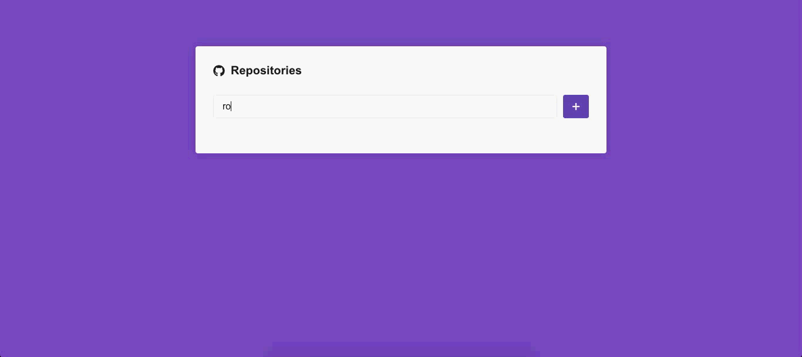

# gostack-desafio-react05

<h1 align="center">
    
</h1>

<h3 align="center">
  Desafio 5: Primeiro projeto com ReactJS
</h3>

## :rocket: Sobre o desafio

Aplicar conhecimentos adquiridos sobre React até o momento

### Funcionalidades

#### :rocket: 1. Captando erros

Adicionar um `try/catch` por volta do código presente na função `handleSubmit` presente no componente `Main` e caso um repositório não seja encontrado na API do Github adicione uma borda vermelha por volta do input em que o usuário digitou o nome do repositório.

#### 2. Repositório duplicado

Tratar os diretórios duplicados com mensagem de erro interna

#### 3. Filtro de estado

Adicionar filtro de listagem de issue, com base no State('open','all' ou 'closed') para listagem das Issues.

#### 4. Paginação

A aplicação criada no bootcamp tem o limite de 5(ou mais) Issues por pagina, então será necessario adicionar paginação para mostrar as Issues restantes

#### 4. Resultado final

---

Feito com ♥ by [Jonathan](https://www.linkedin.com/in/jonathan-barros-franco)
